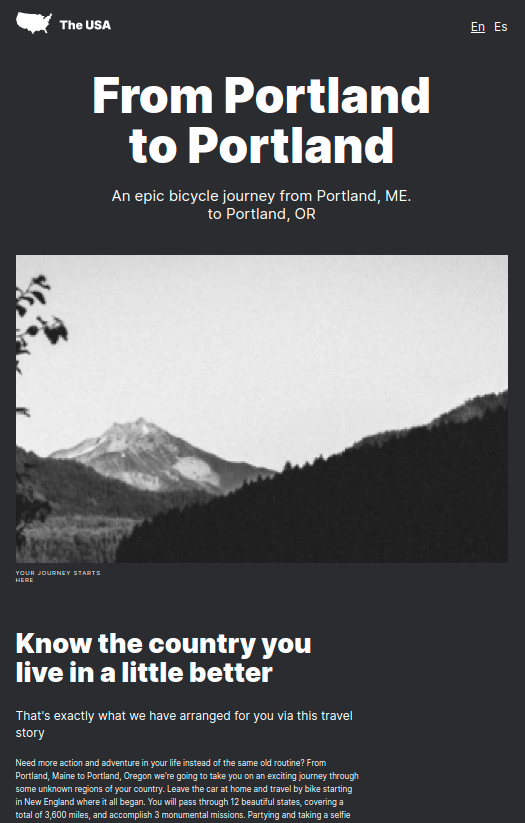

# Yandex / Practicum Project 3
## A coast to coast trip of the US

### **Overview**

This is a single page project about traveling across the US. I've designed it so all the elements are displayed correctly on popular screen sizes.

### Technologies/Languages Used
* Figma
* Terminal/Command line
* HTML
* CSS
* BEM class naming conventions
* BEM Modifier creation/use
* BEM file structure organization
* CSS Flexbox property
* CSS Grid property 
* CSS transition property

**Github Pages Link**

[exmelendez.github.io/web_project_3](https://exmelendez.github.io/web_project_3/)

**Sample Image**

